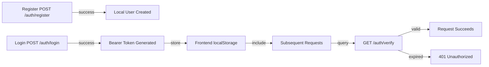

# API Reference - Complete Endpoint Documentation

Comprehensive API documentation for the Legal AI Chatbot system.

## API Overview

- **Base URL**: `http://localhost:8000`
- **Protocol**: HTTP/REST
- **Format**: JSON
- **Auth**: Bearer tokens (for protected endpoints)
- **Docs**: http://localhost:8000/docs (Interactive Swagger UI)

---

## Core Statistics

- **Total Endpoints**: 8
- **Public Endpoints**: 3 (auth, health)
- **Protected Endpoints**: 5 (require valid token - coming soon)
- **Typical Response Time**: 100ms - 5s
- **Rate Limits**: None (local deployment)

---

## 🔑 Authentication Endpoints

### 1. POST `/auth/register` - Register New User

Register a new local user account.

**Request**
```http
POST /auth/register
Content-Type: application/json

{
  "username": "john_lawyer",
  "password": "SecurePass123"
}
```

**Response** (201 Created)
```json
{
  "status": "success",
  "detail": "User registered successfully.",
  "username": "john_lawyer"
}
```

**Response** (400 Bad Request)
```json
{
  "status": "error",
  "detail": "Username already exists."
}
```

**Validation Rules**
- Username: Non-empty, must be unique
- Password: ≥6 characters

**Status Codes**
- 200 OK: Registration successful
- 400 Bad Request: Validation failed (empty username, short password, duplicate user)

**Notes**
- Passwords are hashed using PBKDF2-HMAC-SHA256
- No external database, uses local `local_users.json`
- Each user gets unique 16-byte salt

---

### 2. POST `/auth/login` - User Login

Login with credentials to receive authentication token.

**Request**
```http
POST /auth/login
Content-Type: application/json

{
  "username": "john_lawyer",
  "password": "SecurePass123"
}
```

**Response** (200 OK)
```json
{
  "status": "success",
  "access_token": "eyJzdWIiOiJqb2huX2xhd3llciIsImlhdCI6MTcxMTg2NzM1MywiZXhwIjoxNzExODcwOTUzfQ.mKD335ouKLfnBICRWPS1IqPYpxQjPuA7YNvsz1OXvC0=",
  "token_type": "bearer",
  "username": "john_lawyer"
}
```

**Response** (401 Unauthorized)
```json
{
  "status": "error",
  "detail": "Invalid username or password."
}
```

**Token Format**
- Type: Custom JWT-like format (payload.signature)
- Payload: `{sub: username, iat: timestamp, exp: timestamp}`
- Signature: HMAC-SHA256 signed
- TTL: 1 hour (3600 seconds) by default

**Usage**
```http
Authorization: Bearer <access_token>
```

**Notes**
- Token stored in browser localStorage (frontend)
- Compared using constant-time functions to prevent timing attacks

---

### 3. GET `/auth/verify?token=<TOKEN>` - Verify Token

Verify if a token is valid and not expired.

**Request**
```http
GET /auth/verify?token=eyJzdWIiOiJqb2huX2xhd3llciIsImlhdCI6MTcxMTg2NzM1MywiZXhwIjoxNzExODcwOTUzfQ.mKD335ouKLfnBICRWPS1IqPYpxQjPuA7YNvsz1OXvC0%3D
```

**Response** (200 OK - Valid Token)
```json
{
  "status": "success",
  "username": "john_lawyer",
  "expires_at": 1771887095
}
```

**Response** (401 Unauthorized - Invalid/Expired)
```json
{
  "status": "error",
  "detail": "Invalid or expired token."
}
```

**Parameters**
- `token` (query string): The JWT token to verify

**Notes**
- Returns expiration timestamp in Unix epoch
- Can be called without prior authentication (token in query)

---

## 📄 Document Management Endpoints

### 4. POST `/upload` - Upload Document

Upload a PDF document for processing and indexing.

**Request**
```http
POST /upload
Content-Type: multipart/form-data

file: <binary PDF data>
```

**Example with curl**
```bash
curl -X POST http://localhost:8000/upload \
  -F "file=@contract.pdf"
```

**Response** (200 OK)
```json
{
  "status": "Document uploaded and processed",
  "chunks_created": 45,
  "chunks_added": 42
}
```

**Parameters**
- `file` (form-data, required): PDF file

**Process**
1. Save PDF to `uploads/` directory
2. Extract text from all pages (pdfplumber)
3. Chunk into semantic segments (50-1000 words, target 150)
4. Embed chunks using Sentence Transformers
5. Add to FAISS index
6. Persist index to disk

**Response Codes**
- 200 OK: Upload successful
- 400 Bad Request: No file provided
- 413 Payload Too Large: File > 50MB

**Notes**
- Chunks include source tracking (marked as "upload")
- Latest uploaded file is used by `/analyze` and `/summarize`
- Processing time: 5-15 seconds depending on file size

---

### 5. GET `/analyze` - Analyze Document Risk

Analyze most recently uploaded document for risks.

**Request**
```http
GET /analyze
```

**Response** (200 OK)
```json
{
  "status": "Risk analysis completed",
  "summary": {
    "total_chunks": 45,
    "risk_sections": 8,
    "high_risk": 2,
    "medium_risk": 6
  },
  "risk_sections": [
    {
      "section_index": 3,
      "risk_level": "High",
      "risk_reason": "Employer can terminate without prior notice",
      "section_text": "ARTICLE 2 Section 2.1 This employment may be terminated..."
    },
    {
      "section_index": 7,
      "risk_level": "Medium",
      "risk_reason": "Financial penalty imposed",
      "section_text": "ARTICLE 3 Section 3.4 Liquidated damages shall apply..."
    }
  ]
}
```

**Response** (400 Bad Request - No Document)
```json
{
  "status": "No document uploaded",
  "detail": "Upload a PDF using /upload before running /analyze."
}
```

**Risk Levels**
- **High**: Unfavorable terms, unlimited liability, termination without notice
- **Medium**: Financial penalties, confidentiality breaches, strict requirements
- **Low**: Standard clauses, neutral language

**Notes**
- No request body required
- Scans all chunks from most recent upload
- Non-Gemini operation (local keyword-based detection)
- Risk detection uses keyword + regex matching in `risk_engine.py`
- High risk examples: `rigorous imprisonment`, `non-bailable`, `void ab initio`, `unlimited liability`, `liable to prosecution`
- Medium risk examples: `one lakh rupees`, `late payment fee`, `at the sole discretion`, `subject to arbitration`, `tds shall be deducted`
- Low risk examples: `whereas`, `annexure`, `effective date`, `provided that`
- Regex triggers:
  - High: `punishable\s+with\s+(imprisonment|fine)`, `notwithstanding\s+anything`
  - Medium: `liable\s+to\s+(pay|compensate)`, `at\s+the\s+sole\s+discretion`

---

### 6. GET `/summarize` - Document Summarization

Generate a summary of most recently uploaded document.

**Request**
```http
GET /summarize
```

**Response** (200 OK)
```json
{
  "status": "success",
  "summary": "This is an Employment Agreement between XYZ Corporation and the Employee. The agreement covers terms of employment starting January 1, 2024. The employee will receive a base salary of $X, health insurance, and 401(k) benefits. Employment is at-will with 30 days notice required for termination. The employee agrees to confidentiality obligations and a 2-year non-compete clause post-employment. Key obligations include work performance expectations and intellectual property assignment to the company."
}
```

**Response** (400 Bad Request - No Document)
```json
{
  "status": "error",
  "detail": "No document uploaded. Upload a PDF using /upload before running /summarize."
}
```

**Generated Summary Includes**
- Key parties involved
- Document type
- Main objectives and scope
- Important terms and conditions
- Critical clauses and obligations
- Performance and payment terms

**Notes**
- Uses Google Gemini API
- 2-3 paragraph summaries (not full document)
- Requires GEMINI_API_KEY configured
- Processing time: 3-8 seconds

---

## 💬 Q&A Endpoints

### 7. POST `/ask` - Ask Question

Ask a question about documents and legal knowledge base.

**Request**
```http
POST /ask
Content-Type: application/json

{
  "query": "What is the termination clause?"
}
```

**Response** (200 OK)
```json
{
  "question": "What is the termination clause?",
  "answer": "The termination clause states that either party may terminate this employment agreement with 30 days written notice. Termination without cause requires severance equal to 1 month salary. Termination for cause (gross misconduct) results in immediate dismissal without severance.",
  "answer_source": "retrieval",
  "clause_reference": "Section 5",
  "confidence_score": 0.92,
  "risk_level": "Medium",
  "risk_reason": "30-day termination clause requires severance"
}
```

**Response** (200 OK - Fallback)
```json
{
  "question": "What is quantum mechanics?",
  "answer": "Note: This question was not found in the project knowledge base. The following is a general Gemini response.\n\nQuantum mechanics is...",
  "answer_source": "gemini_fallback",
  "clause_reference": "Not Available",
  "confidence_score": 0.0,
  "risk_level": "Unknown",
  "risk_reason": "No relevant clause found in knowledge base"
}
```

**Request Parameters**
- `query` (string, required): The question to ask

**Response Fields**
- `question`: Echo of user query
- `answer`: Generated answer text
- `answer_source`: Where answer came from
  - "retrieval": From document via RAG
  - "retrieval_direct_clause": Direct section lookup
  - "reranker": Fine-tuned ranking
  - "gemini_fallback": General knowledge
- `clause_reference`: Section/clause name or "Not Available"
- `confidence_score`: 0.0-1.0 reliability metric
- `risk_level`: High/Medium/Low/Unknown
- `risk_reason`: Why that risk level

**Query Processing Pipeline**
1. Spell correction (typo fixes)
2. Legal reference extraction ("Section X of Y")
3. Exact question match (with fuzzy tolerance)
4. Semantic FAISS search (if no exact match)
5. LLM routing (Ollama → Gemini on timeout)
6. Risk detection on returned clause
7. Response composition

**Example Queries**
```bash
# Legal reference
curl -X POST http://localhost:8000/ask \
  -H "Content-Type: application/json" \
  -d '{"query":"What is section 1 of Aadhaar Act?"}'

# Definition
curl -X POST http://localhost:8000/ask \
  -H "Content-Type: application/json" \
  -d '{"query":"What is indemnity?"}'

# Clause lookup
curl -X POST http://localhost:8000/ask \
  -H "Content-Type: application/json" \
  -d '{"query":"What are the penalties for breach?"}'
```

**Notes**
- Handles spelling mistakes via correction
- Supports natural language and legal references
- Confidence scores: 0.95+ = very high, 0.80+ = high, < 0.60 = low
- Falls back to Gemini if no local match
- Risk scoring applied to retrieved clause
- Processing time: 100ms (cache) to 5s (LLM)

---

## 🏥 Health & Status Endpoints

### 8. GET `/` - Health Check

Basic health check for API availability.

**Request**
```http
GET /
```

**Response** (200 OK)
```json
{
  "status": "Legal AI Backend Running"
}
```

**Usage**
```bash
curl http://localhost:8000/
```

**Notes**
- No authentication required
- Used for monitoring and loadbalancer health checks
- Lightweight, ~1ms response time

---

## 📊 API Statistics & Metrics

### Request/Response Sizes

| Endpoint | Avg Request | Avg Response | Peak |
|----------|------------|---------------|----|
| `/ask` | 100 bytes | 1-2 KB | 5 KB |
| `/upload` | 2-50 MB | 200 bytes | 500 MB |
| `/analyze` | 0 bytes | 5-20 KB | 100 KB |
| `/summarize` | 0 bytes | 2-5 KB | 10 KB |
| Auth | 50-100 bytes | 500 bytes | 1 KB |

### Response Times (ms)

| Endpoint | Min | Avg | Max |
|----------|-----|------|-----|
| Health check | 1 | 2 | 5 |
| Auth (login) | 10 | 50 | 200 |
| Ask (cache) | 100 | 200 | 500 |
| Ask (semantic) | 500 | 1500 | 3000 |
| Ask (LLM) | 1000 | 2500 | 5000 |
| Upload | 5000 | 10000 | 15000 |
| Analyze | 2000 | 5000 | 10000 |
| Summarize | 3000 | 6000 | 10000 |

---

## 🐛 Error Codes & Messages

### HTTP Status Codes

| Code | Meaning | Common Causes |
|------|---------|--------------|
| 200 | OK | Successful request |
| 400 | Bad Request | Missing field, invalid file type |
| 401 | Unauthorized | Invalid/expired token, wrong credentials |
| 404 | Not Found | Non-existent endpoint |
| 413 | Payload Too Large | File > 50MB |
| 500 | Server Error | Backend exception, missing API key |

### Common Error Responses

**No Document Uploaded**
```json
{
  "status": "No document uploaded",
  "detail": "Upload a PDF using /upload before running /analyze."
}
```

**Invalid Credentials**
```json
{
  "status": "error",
  "detail": "Invalid username or password."
}
```

**Registration Error**
```json
{
  "status": "error",
  "detail": "Password must be at least 6 characters."
}
```

**Server Error**
```json
{
  "status": "error",
  "detail": "Failed to generate summary: API key not configured"
}
```

---

## 🔐 Authentication Flow

### Token-Based Authentication



### Using Tokens

```bash
# Include in Authorization header
curl -H "Authorization: Bearer <token>" \
     http://localhost:8000/protected-endpoint

# Or as query parameter
curl http://localhost:8000/auth/verify?token=<token>
```

---

## 📚 Data Schemas (TypeScript)

```typescript
// Authentication
interface LoginRequest {
  username: string;
  password: string;
}

interface AuthResponse {
  status: 'success' | 'error';
  detail?: string;
  access_token?: string;
  token_type?: string;
  username?: string;
  expires_at?: number;
}

// Questions
interface Question {
  query: string;
}

interface AskResponse {
  question: string;
  answer: string;
  answer_source: 'retrieval' | 'reranker' | 'gemini_fallback';
  clause_reference: string;
  confidence_score: number; // 0.0-1.0
  risk_level: 'High' | 'Medium' | 'Low' | 'Unknown';
  risk_reason: string;
}

// Documents
interface UploadResponse {
  status: string;
  chunks_created: number;
  chunks_added: number;
}

interface RiskSection {
  section_index: number;
  risk_level: string;
  risk_reason: string;
  section_text: string;
}

interface AnalyzeResponse {
  status: string;
  summary: {
    total_chunks: number;
    risk_sections: number;
    high_risk: number;
    medium_risk: number;
  };
  risk_sections: RiskSection[];
}

interface SummarizeResponse {
  status: string;
  summary: string;
}
```

---

## 🔗 API Endpoint Summary Table

| Method | Endpoint | Auth | Purpose |
|--------|----------|------|---------|
| POST | `/auth/register` | No | Register new user |
| POST | `/auth/login` | No | Login and get token |
| GET | `/auth/verify` | No | Verify token validity |
| POST | `/upload` | No | Upload PDF document |
| GET | `/analyze` | No | Risk analysis |
| GET | `/summarize` | No | Document summary |
| POST | `/ask` | No | Ask question |
| GET | `/` | No | Health check |

---

## 💻 Code Examples

### Python Client

```python
import requests

BASE_URL = "http://localhost:8000"

# Register
response = requests.post(f"{BASE_URL}/auth/register", json={
    "username": "lawyer1",
    "password": "secure123"
})
print(response.json())

# Login
login_resp = requests.post(f"{BASE_URL}/auth/login", json={
    "username": "lawyer1",
    "password": "secure123"
})
token = login_resp.json()["access_token"]

# Upload
with open("contract.pdf", "rb") as f:
    upload_resp = requests.post(
        f"{BASE_URL}/upload",
        files={"file": f}
    )
print(upload_resp.json())

# Ask
ask_resp = requests.post(f"{BASE_URL}/ask", json={
    "query": "What is the termination clause?"
})
print(ask_resp.json())
```

### JavaScript/Fetch

```javascript
const BASE_URL = "http://localhost:8000";

// Register
const registerRes = await fetch(`${BASE_URL}/auth/register`, {
  method: "POST",
  headers: { "Content-Type": "application/json" },
  body: JSON.stringify({
    username: "lawyer1",
    password: "secure123"
  })
});

// Login
const loginRes = await fetch(`${BASE_URL}/auth/login`, {
  method: "POST",
  headers: { "Content-Type": "application/json" },
  body: JSON.stringify({
    username: "lawyer1",
    password: "secure123"
  })
});
const { access_token } = await loginRes.json();

// Ask
const askRes = await fetch(`${BASE_URL}/ask`, {
  method: "POST",
  headers: {
    "Content-Type": "application/json",
    "Authorization": `Bearer ${access_token}`
  },
  body: JSON.stringify({
    query: "What is the liability clause?"
  })
});
const answer = await askRes.json();
console.log(answer);
```

### cURL Examples

```bash
# Register
curl -X POST http://localhost:8000/auth/register \
  -H "Content-Type: application/json" \
  -d '{"username":"user1","password":"pass123"}'

# Login
curl -X POST http://localhost:8000/auth/login \
  -H "Content-Type: application/json" \
  -d '{"username":"user1","password":"pass123"}'

# Upload
curl -X POST http://localhost:8000/upload \
  -F "file=@contract.pdf"

# Ask
curl -X POST http://localhost:8000/ask \
  -H "Content-Type: application/json" \
  -d '{"query":"what is liability?"}'

# Analyze
curl -X GET http://localhost:8000/analyze

# Summarize
curl -X GET http://localhost:8000/summarize
```

---

## 🔜 Future API Enhancements

- **Protected Endpoints**: Add token requirement to endpoints
- **Rate Limiting**: Implement per-user rate limits
- **Batch Operations**: Upload multiple documents
- **Search History**: Query analytics and trends
- **Webhooks**: Real-time notifications
- **API Keys**: Long-lived keys for integrations
- **Versioning**: `/v1/ask`, `/v2/ask`

---

**API Version:** 1.0  
**Last Updated:** February 24, 2026  
**Interactive Docs**: http://localhost:8000/docs
